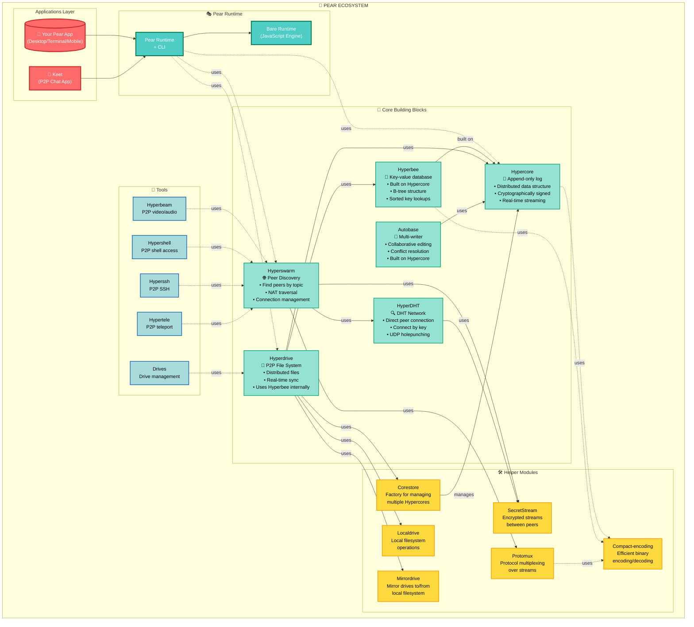

# Architecture

```mermaid
graph TB
    subgraph "🍐 PEAR ECOSYSTEM"
        subgraph "Applications Layer"
            APP[("🎯 Your Pear App<br/>(Desktop/Terminal/Mobile)")]
            KEET["📱 Keet<br/>(P2P Chat App)"]
        end

        subgraph "🎭 Pear Runtime"
            PEAR["Pear Runtime<br/>+ CLI"]
            BARE["Bare Runtime<br/>(JavaScript Engine)"]
            PEAR --> BARE
        end

        subgraph "🧱 Core Building Blocks"
            HC["Hypercore<br/>📜 Append-only log<br/>• Distributed data structure<br/>• Cryptographically signed<br/>• Real-time streaming"]
            
            HB["Hyperbee<br/>🐝 Key-value database<br/>• Built on Hypercore<br/>• B-tree structure<br/>• Sorted key lookups"]
            
            HD["Hyperdrive<br/>📁 P2P File System<br/>• Distributed files<br/>• Real-time sync<br/>• Uses Hyperbee internally"]
            
            HS["Hyperswarm<br/>🌐 Peer Discovery<br/>• Find peers by topic<br/>• NAT traversal<br/>• Connection management"]
            
            HDHT["HyperDHT<br/>🔍 DHT Network<br/>• Direct peer connection<br/>• Connect by key<br/>• UDP holepunching"]
            
            AB["Autobase<br/>🔄 Multi-writer<br/>• Collaborative editing<br/>• Conflict resolution<br/>• Built on Hypercore"]
        end

        subgraph "🛠️ Helper Modules"
            CS["Corestore<br/>Factory for managing<br/>multiple Hypercores"]
            
            PM["Protomux<br/>Protocol multiplexing<br/>over streams"]
            
            SS["SecretStream<br/>Encrypted streams<br/>between peers"]
            
            LD["Localdrive<br/>Local filesystem<br/>operations"]
            
            MD["Mirrordrive<br/>Mirror drives to/from<br/>local filesystem"]
            
            CE["Compact-encoding<br/>Efficient binary<br/>encoding/decoding"]
        end

        subgraph "🔧 Tools"
            HBEAM["Hyperbeam<br/>P2P video/audio"]
            HSHELL["Hypershell<br/>P2P shell access"]
            HSSH["Hyperssh<br/>P2P SSH"]
            HTELE["Hypertele<br/>P2P teleport"]
            DRIVES["Drives<br/>Drive management"]
        end
    end

    %% Application connections
    APP --> PEAR
    KEET --> PEAR
    
    %% Pear Runtime to Building Blocks
    PEAR -.uses.-> HC
    PEAR -.uses.-> HS
    PEAR -.uses.-> HD
    
    %% Building Block relationships
    HB -->|built on| HC
    HD -->|uses| HB
    HD -->|uses| HC
    AB -->|uses| HC
    HS -->|uses| HDHT
    HS -->|uses| SS
    
    %% Helper connections
    HD -->|uses| CS
    CS -->|manages| HC
    HD -->|uses| LD
    HD -->|uses| MD
    HS -->|uses| PM
    HDHT -->|uses| SS
    
    %% Encoding used everywhere
    HC -.uses.-> CE
    HB -.uses.-> CE
    PM -.uses.-> CE
    
    %% Tools use building blocks
    HBEAM -.uses.-> HS
    HSHELL -.uses.-> HS
    HSSH -.uses.-> HS
    HTELE -.uses.-> HS
    DRIVES -.uses.-> HD

    %% Styling
    classDef appStyle fill:#ff6b6b,stroke:#c92a2a,stroke-width:3px,color:#fff
    classDef runtimeStyle fill:#4ecdc4,stroke:#087f5b,stroke-width:3px,color:#fff
    classDef coreStyle fill:#95e1d3,stroke:#0ca678,stroke-width:2px,color:#000
    classDef helperStyle fill:#ffd93d,stroke:#f59f00,stroke-width:2px,color:#000
    classDef toolStyle fill:#a8dadc,stroke:#1864ab,stroke-width:2px,color:#000

    class APP,KEET appStyle
    class PEAR,BARE runtimeStyle
    class HC,HB,HD,HS,HDHT,AB coreStyle
    class CS,PM,SS,LD,MD,CE helperStyle
    class HBEAM,HSHELL,HSSH,HTELE,DRIVES toolStyle
```
